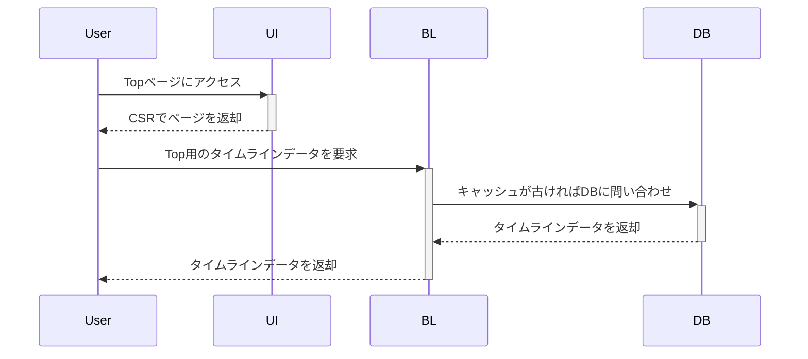
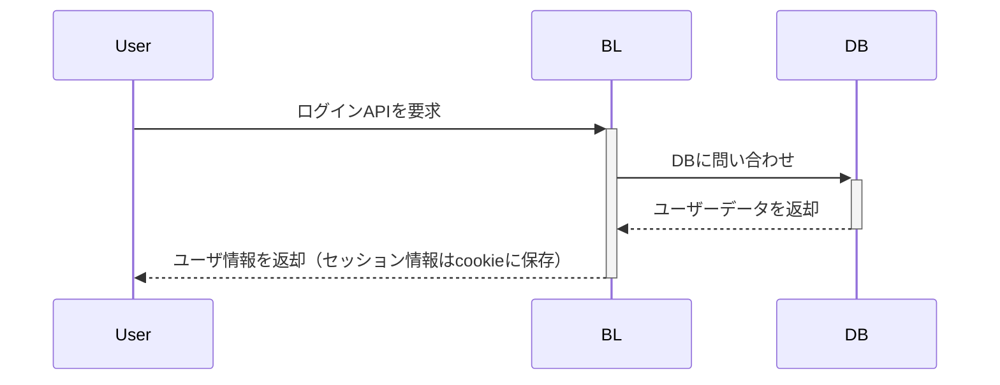
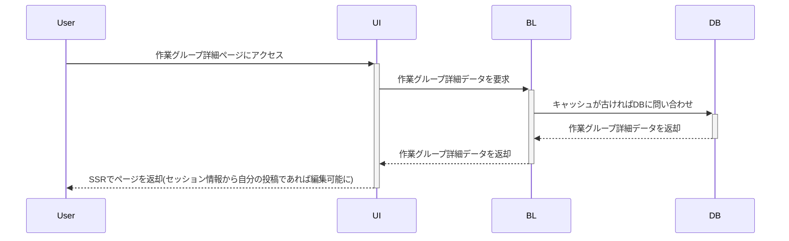
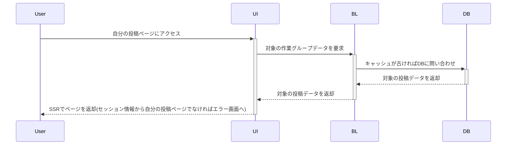

## リリース予定
### 必要機能
v0.0.5
* 認証機能(外部認証OAuthなどを利用)
  - [ ] supabaseAuth
  - [ ] その他外部OAuth認証
    - [x] GoogleOAuth認証
* 投稿機能
  - [x] 画像アップロード(webp形式)
  - [x] 新規投稿（グループ作成）
  - [x] 追加投稿
  - [ ] グループ投稿編集
* [x] タイムライン機能
  - [x] 今日更新されたもの（更新された順）
  - [x] 作業中のグループ投稿（更新された順）
  - [x] 完了したグループ投稿（更新された順）
* [x] 進捗詳細閲覧機能
  - [x] 自身のすべての投稿表示
  - [x] 自身の作業中投稿表示
  - [x] 自身の完了した投稿表示

* 投稿ユーザ招待制機能
  - [ ] 期限付き招待リンク

ここ目度でリリース（投稿者は招待制）
投稿の整合性やセキュリティはある程度しっかりと

---

v0.1.0
* ユーザ情報照会・更新機能
* 共有機能（ワンボタンで外部SNSと連携）
* アクション機能（いいね、スタンプ）

以降の構想
* ポイント機能(mochi)
  * ログインボーナスや投稿頻度でポイントゲット(作業終了 => 投稿数 × 1mochi)
  * ポイントから特別な応援スタンプや投稿数を増やせる
  * ポイントを課金でも買えるように(1mochi = 1円みたいな)

* 作業配信（ワークスペース）

## スキルスタック
+ React/Next.js
+ Typescript
+ Node.js
+ GitHub
+ GitHub Copilot
+ Vercel（予定）

### 処理フローイメージ
#### Top画面

#### ログイン処理

##### 作業グループ詳細画面（未ログイン・ログイン済）

#### 自分の投稿画面

### テーブル定義
作業グループテーブル
物理名|型|備考
---|---|---
group_id       | uuid         |pk
user_id        | varchar(50)  |fk
title          | varchar(50)
content        | varchar(2000)
images         | URL[]
close_flag     | boolean
create_datetime| timestanp
update_datetime| timestanp
delete_flag    | boolean
delete_datetime| timestanp

作業ポストテーブル
物理名|型|備考
---|---|---
post_id        | uuid         |pk
group_id       | uuid         |fk
image          | URL
content        | varchar(300)
create_datetime| timestanp
update_datetime| timestanp
delete_flag    | boolean
delete_datetime| timestanp

ユーザ情報テーブル
物理名|型|備考
---|---|---
user_id        | varchar(50)|pk
uid            | uuid       |fk
user_name      | string
icon_image     | string
note           | string
create_datetime| timestanp
update_datetime| timestanp
delete_flag    | boolean
delete_datetime| timestanp
